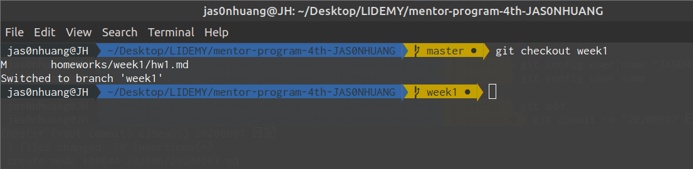
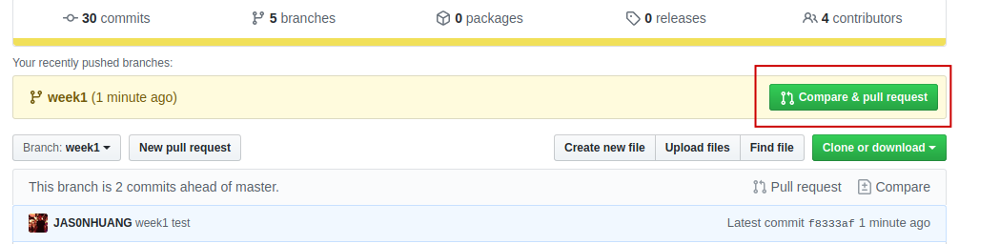

## 交作業流程
### 前置作業
1. 建立作業資料夾/程式庫（repository）  
點擊 [GitHub Classroom](https://classroom.github.com/a/SbDvk2VA) 連結，會自動生成一個 GitHub 程式庫（repository），名稱會是：`mentor-program-4th-你的帳號`。
2. 把自動生成的程式庫 clone 到自已的電腦上  
`git clone https://github.com/Lidemy/mentor-program-4th-你的帳號.git`
然後 cd 到程式庫裡：`cd ./mentor-program-4th-你的帳號`
3. 安裝 node 以及 npm install 課程相關套件  
node 安裝方式詳見[官網](https://nodejs.org/en/download/), 其實就是一直下一步。  
然後 `npm install` 安裝相關套件，這裡 npm 會跳出一些安全性修正的警告，要不要運行 `npm audit fix` 都沒有關係，我是看到那些紅紅黃黃的字就不太高興，所以就都 fix 下去了。  
npm 安裝的主要是 linting 用的工具。
>linting 是啥？就是讓電腦先把咱們寫的跟史一樣的程式碼先改過一遍，避免老師看到太多髒東西！當然，也避免以後別人覺得我們是髒東西……

3. 開一個 branch 然後 checkout 到這個 branch  
一定要開一個新 branch 寫作業，不要在 master 上面寫作業
`git checkout -b week1`

### 在自已的程式庫裡寫功課
1. 打開 ./homeworks/week1/hw1.md 檔案就可以開始寫功課了。
2. 功課寫完，`:wq` 之後  
`git add week1/hw1.md`  
`git commit -m "寫完第一週功課"`
3. 推上 GitHub  
`git push origin week1`
4. 在 GitHub 的程式庫頁面會出現一個 "Your recently pushed branches:" 區塊，點擊 "compare & pull request"。

5. 在 Open a pull request 頁面輸入標題、寫上一些心得或問題，就可以按下 "Create pull request"。

### 到學習系統裡交作業
1. 進入[作業列表](https://learning.lidemy.com/homeworks)，按「新增作業」。
2. 選擇週次，然後貼上剛剛 pull request 的網址。

### 老師或助教上場時間
1. 通過：助教合併 pull request，刪除寫作業分支。
2. 不通過：重開一個 branch 再寫一遍。

### 作業通過後同步遠端與本地端程式庫
1. 本地端切換回 master 分支，然後將遠端 master 分支 pull 下來。  
`git checkout master`  
`git pull origin master`
2. 刪除本地端作業分支  
`git branch -d weekX`

### 與老師的程式庫同步
如果課綱內容有變動，需要與老師的程式庫同步
1. 確認自已回到自已作業程式庫的 master 分支上。
2. 確認作業都已經寫完，或者已經完成 commit （也就是 `git status` 時顯示不需要 commit）
3. `git pull https://github.com/Lidemy/mentor-program-4th.git master` 把老師的程式庫 pull 下來
4. 再運行 `git push origin master` 推到自已遠端的庫裡。
