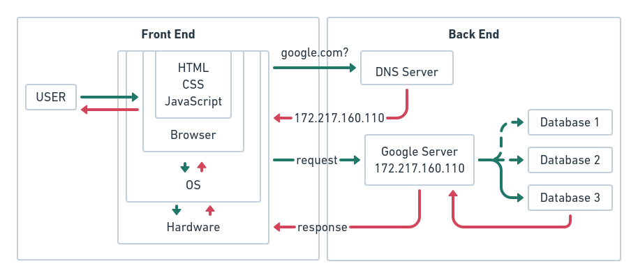

## 請解釋後端與前端的差異。
所有與使用者直接接觸到的部分都是前端，顯示在瀏覽器上的網頁、圖片、網頁上的一些互動……等等。  
使用者看不到的部分就是後端了，像是處理請求、回應的伺服器、資料庫……等等  
附上一張網路基本架構圖：

## 假設我今天去 Google 首頁搜尋框打上：JavaScri[t 並且按下 Enter，請說出從這一刻開始到我看到搜尋結果為止發生在背後的事情。
1. 在按下 Enter 的時候，Google 網頁會觸發按下 Enter 鍵的前端程式碼
2. 瀏覽器會通知網路卡，網路卡會去 DNS 伺服器要求查詢 ip 位址
2. 連上 Google 伺服器後，前端程式碼對 Google 伺服器（後端）發出一個請求（request），要求查找資料庫裡面有關 JavaScript 這個字串的資料
3. 前端送出請求之後等待伺服器回應（response）
4. 伺服器在資料庫裡尋找用戶需要的資料
5. 伺服器找到資料後會將回應回傳給前端程式
6. 前端程式接受回應，經過處理後將資料傳給 DOM 然後重新建構 HTML/CSS 將畫面顯示在瀏覽器中。

## 請列舉出 3 個「課程沒有提到」的 command line 指令並且說明功用
### less - opposite of more
（man 實在是太幽默了…）
算是 cat 的變化版，主要的差別是 cat 會直接輸出整份文件一直到最底部，然後直接跳出到命令列，所以也不能夠使用鍵盤上下捲動，雖然可以用滑鼠中鍵滾輪或右側捲動，但是就是沒那麼方便；less 真的好用多了，除了可以用 VIM `jk` 鍵上下捲動之外，還可以用 `/` 進行搜尋，最重要的是，這些動作手腕都不用移動，大大增加查看文件的工作效率阿！
不過……我通常要看比較長的文件還是直接用 VIM 了。

### ln - make links between files
這個命令其實有點複雜，我到現在也有些概念沒有很懂，所以通常我就只是用 ln -s 當作 windows 上「建立捷徑」的代替品。
看看又長又精美的作業程式庫名稱，還要穿越 homeworks、weekX 資料夾，就算用 tab 自動補齊也是要 tab 半天。
`ln -s ./mentor-program-4th-JAS0NHUANG/homeworks/week1 ~/Desktop/week1` 就可以在桌面建立一個 `week1` 捷徑，你看我現在不論是用 CLI 或是 GUI 進到作業資料夾都好快阿！

### wc - print newline, word, and byte counts for each file
Word Count，列出檔案的列數、字數、以及字元數
