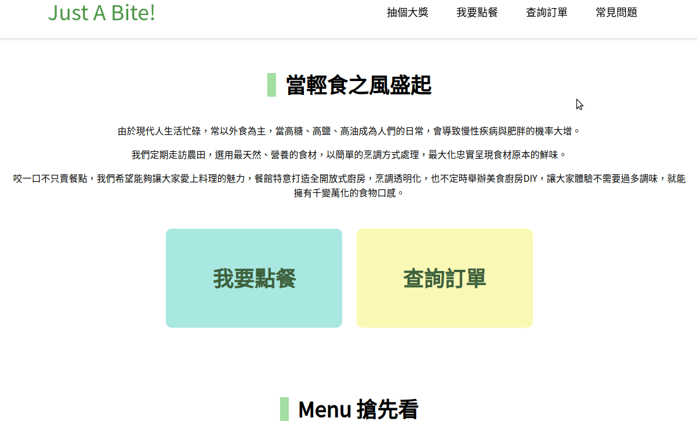
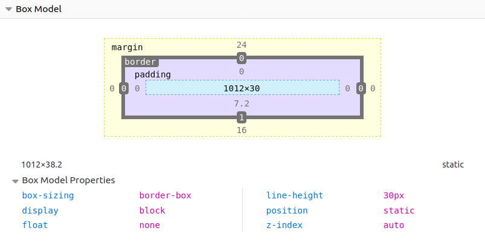

## 請找出三個課程裡面沒提到的 HTML 標籤並一一說明作用。

語義化標籤（內容分區）：  
  - `<main>` 標示一個頁面的主要區塊。通常會放入整個網頁的主要內容或功能。
  - `<aside>` 標示一個頁面的次要、邊緣區塊。通常會是頁面的側邊欄位、標注區塊或廣告區塊。

文字相關：   
  - `<blockquote>` 區塊引用
    <blockquote>這是區塊引用飯粒！</blockquote>  

多媒體內容相關：  
  - `<audio>` 可以在 html 裡面加入聲音檔，以 `src` 指定檔案來源。  
    <audio preload="none" controls="" class="track-audio" src="http://ccmixter.org/content/airtone/airtone_-_forgottenland.mp3" type="audio/mpeg">Your browser does not support the audio element</audio>  
    (音樂來源：ccmixter.org - ["forgottenland" by airtone](http://ccmixter.org/files/airtone/61959)）

腳本、程式碼：  
  - `<canvas>` 提供一個畫布。我們熟悉的 JavaScript 除了可以為頁面加上互動功能，還可以在 `<canvas>` 標籤裡面畫圖。（另外 svg 其實也可以算是畫布，兩者的差異我只有一點點粗淺的概念，有興趣的人可以再自已去研究囉！）  

參考資料：  
[W3Schools - HTML Element Reference](https://www.w3schools.com/TAGs/)  
[MDN - HTML elements reference](https://developer.mozilla.org/en-US/docs/Web/HTML/Element)  
[D3 筆記二：SVG、Canvas、畫布、矩形、填充圖形](https://codertw.com/%E7%A8%8B%E5%BC%8F%E8%AA%9E%E8%A8%80/552741/)  
[SVG vs Canvas](https://www.educba.com/svg-vs-canvas/)

## 請問什麼是盒模型（box modal）
所有的網頁都是由一個一個的 box 所組成，頁面上每一個區塊都是一個 box 而這些 box 又各自有自已的 margin、border、padding 與 content。
光看文字其實不太容易理解，加上一些圖片會比較好解釋：

上面這張圖使用 Chrome 上面一個叫作 Pesticide 的外掛，它的作用就是可以把所有網頁上的 box 用框框標示出來, 沒有啟用之前我們可以看一般頁面顯示出來的樣子，啟用之後就可以看到每一個元素都是一個框框，標題是一個框框，按鈕是一個框框，選單是一個框框，選單內的連結也各自都是框框，就像剛剛說的，網頁就是這些框框（box）所組合起來的。

上面這張圖則是使用 devtools 開啟，顯示的是每一個框框的內部狀態，可以看到，由外而內有 margin、border、padding 以及最中心的 content。他們都分別可以被設定大小（寬度、高度、粗細……），我們所設定的 properties 會決定它在頁面上顯示的狀態、大小、位置……等等。

有了「框框」的概念之後，display 與 position 的設定就不難理解了。

## 請問 display: inline, block 跟 inline-block 的差別是什麼？
決定「框框」佔位的方式。
下面這張圖雖然是日文的，但是我覺得很清楚的把 display 的三個屬性呈現出來。
  
圖片來源：[【CSS】displayの使い方を総まとめ！inlineやblockの違いは？](https://saruwakakun.com/html-css/basic/display#section6)  

用簡單的文字總結：

- inline：
  - 橫向並列
  - 無法指定寬高
  - 可設定左右 padding 與 margin（會對左右元素的位置造成影響）
  - 不可設定上下 margin
  - 可設定上下 padding （對上下元素位置不會造成影響）
  - 可設定內部文字橫向、縱向對齊  
- block：
  - 佔滿整列（橫向）
  - 可自由設定寬高、padding 與 margin (會對其它元素造成影響）
  - 不可設定內部文字橫、縱向對齊
- inline-block：（上兩者的合體！）
  - 橫向並列（inline）
  - 可自由設定寬高、padding 與 margin （會對其它元素造成影響）（block）
  - 可設定內部文字橫向、縱向對齊（inline）

## 請問 position: static, relative, absolute 跟 fixed 的差別是什麼？
決定「框框」放在哪裡！
- static：
  - 元素預設的放置方法
  - 無法設定 top、bottom、left、right
  - 無法做為 relative、absolute 元素的基準點。
- relatavie：
  - 元素「相對」於它預設的位置擺放
  - 以四個邊為基準點設定 top、bottom、left、right
  - 沒有設定上下左右位移的話，它的位置就會跟預設位置一樣
  - 可做為 relative、absolute 元素的基準點。
  
- absolute：
  - 會找到上一層的「可定位元素」（relative、absolute 或 fixed），然後以它為定位基準。
  - 如果完全沒有上一層可定位元素就會以 body 為定位基準。
  - 以四個邊為基準點設定 top、bottom、left、right
  - 可做為 relative、absolute 元素的基準點。
  
- fixed：
  - 以瀏覽器視窗做為定位基準。
  - 不會因頁面捲動改變位置。
  - 以四個邊為基準點設定 top、bottom、left、right
  - 可做為 relative、absolute 元素的基準點。
  

參考資料：
[CSSのpositionを総まとめ！absoluteやfixedの使い方は？](https://saruwakakun.com/html-css/basic/relative-absolute-fixed)
