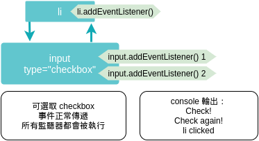
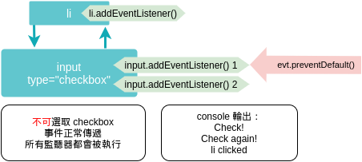
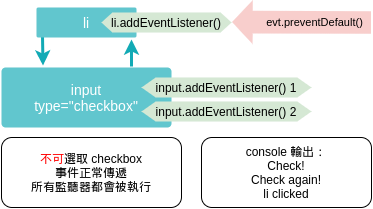
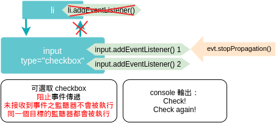
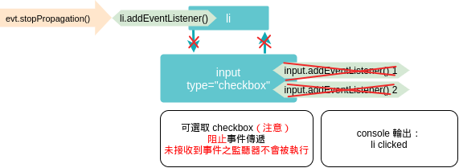
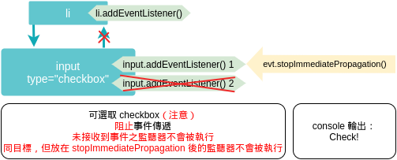

## 什麼是 DOM？
Document Object Model （文件物件模型）是一個在瀏覽器上提供的介面，瀏覽器將 html 文件（document） 解析為一個個的節點（node）、物件（object），讓我們能用 JavaScript 或其它程式語言來操作、使用它們。  

DOM 其實就是瀏覽器提供給我們的一個 API，讓我們能夠在一個固定的標準上去操作網頁裡的元素。  

一個 DOM 簡略示意圖：
```
Document
└─── <html>
      ├── <head>
      │   ├── <title>
      │         └── "My Web Site"
      └── <body>
          ├── <h1>
                └── "My Web Site"
```

參考資料：  
[MDN - Document Object Model](https://developer.mozilla.org/en-US/docs/Web/API/Document_Object_Model)  
[Wikipedia - 文件物件模型](https://zh.wikipedia.org/wiki/%E6%96%87%E6%A1%A3%E5%AF%B9%E8%B1%A1%E6%A8%A1%E5%9E%8B)

## 事件傳遞機制的順序是什麼；什麼是冒泡，什麼又是捕獲？
DOM 事件傳遞機制的順序是捕獲、目標、冒泡。  
詳細的過程其實 W3.org 的這張圖片其實就很清楚的表現出來。


當瀏覽器偵測到使用者事件的時候（可能是點擊、打字、選擇某個元素……），事件傳遞機制就會被觸發：
1. 捕獲：從瀏覽器的網頁視窗（window）開始，進入文件（document），進入 HTML，然後一層一層的傳到觸發事件的目標。如果過程有監聽器則會運行監聽器內容程式碼。
2. 目標：傳遞到目標，屬於獨立的階段，不屬於捕獲也不屬於冒泡。如果目標上有監聽器則會按加入的順序運行。
3. 冒泡：從目標開始，一層層回傳到網頁視窗為止。同樣會運行過程中監聽器內容程式碼。

我自已的理解是，其實我們在瀏覽網頁時，瀏覽器就會不停的在偵測我們的行為，不論我們有沒有加上監聽器，捕獲、目標、冒泡這個流程是一直在進行的，而我們在某個網頁元素上加上監聽器就是讓我們能對 DOM 裡發生的事件做出反應。

參考資料：  
[W3 - Event dispatch and DOM event flow](https://www.w3.org/TR/DOM-Level-3-Events/#event-flow)

## 什麼是 event delegation，為什麼我們需要它？
顧名思意，「事件代理」就是找個「處理事件的代理人」，其實就是利用事件傳遞機制的特性，在父元素上加上監聽器，指定它作為其下子元素的「代理人」。  

它可以讓程式碼看起來更簡單、更有效率，只要在一個父元素上面加上監聽器就可以處理所有子元素的事件，當子元素越來越多的時候更能夠看出它的優點。  

另外一個很重要的原因就是，如果有需要動態新增元素，那麼我們在父元素上所加入的監聽器就可以同時偵測到這些動態新增的子元素，也就像是子元素都被加上監聽器，可以對事件做出反應了。

## event.preventDefault() 跟 event.stopPropagation() 差在哪裡，可以舉個範例嗎？
event.preventDefault() 阻止使用此方法之元素（與其子元素）的預設行為，但是並不影響 DOM 事件的傳遞。  
event.stopPropagation() 阻止 DOM 事件在使用此方法之元素之後繼續傳遞，但是不會影響已接收到事件的元素預設行為。  
兩句解釋跟文言文一樣……其實想說明的是這兩個 DOM event 的方法其實是完全不同性質、不同功能的，一個影響的是元素的行為，另一個影響的是 DOM 事件傳遞。  
下面舉個簡單的範例：  
```html
<ul>
  <li>
    <input type="checkbox">
  </li>
</ul>

<script>
  const checkbox = document.querySelector('input[type=checkbox]')
  const listItem = document.querySelector('li')

  checkbox.addEventListener('click', evt => {
    console.log('Check!') 
  })

  checkbox.addEventListener('click', evt => {
    console.log('Check again!')
  })

  listItem.addEventListener('click', evt => {
    console.log('li clicked')
  })
</script>
```
一個不排序清單，一個清單項目，項目裡一個 checkbox。  
- 在沒有加上任何 preventDefault 或 stopPropagation 的時候執行的結果長這樣：（addEventListener 放在右邊代表加在冒泡階段，放在左邊代表加在捕獲階段。）  

    

- 在 input 或 li 上的監聽器加上 evt.preventDefault() （不論是加在 捕獲或冒泡階段）都會讓 checkbox 無法被選取，但是事件仍然會正常傳遞：  

    
---
    

- 在 checkbox 加上 stopPropagation 會阻止事件傳遞，但是 checkbox 可以被選取。而且同目標的所有監聽器仍然會被執行。  
  
- 在 li 的捕獲階段加上 stopPropagation，兩個 input 的監聽器不會被執行，**但是 checkbox 仍然可以被選取**。  
  
- 在 input 加上 stopImmediatePropagation，會阻止其後同目標的監聽器被執行，checkbox 仍可以被選取。  
  

